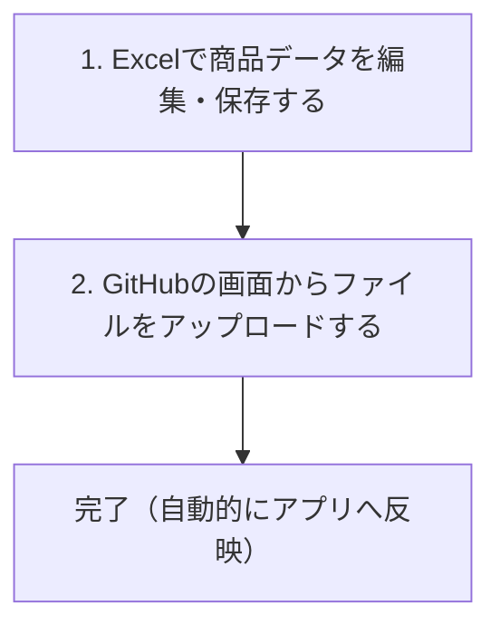

# CAGUUU 接客サポートアプリ 商品データ更新マニュアル

このマニュアルでは、店舗スタッフが使用する「CAGUUU 接客サポートアプリ」の商品データを最新の状態に更新する手順を説明します。
専門的なシステム知識がなくても、**Excelでの編集**と**ブラウザでの簡単なアップロード**だけで作業が完了します。

---

## 全体の大まかな流れ

商品データの更新は、以下の2つのステップで行います。

1. **Excelで商品データを編集・保存する**（文字化けを防ぐ設定で保存します）
2. **GitHub（ブラウザ）にファイルをアップロードする**（ドラッグ＆ドロップで上書きします）

---

## 🛠️ ステップ 1：Excelで商品データを編集・保存する

アプリで読み込む商品データは、リポジトリのルートにある `products.csv` というファイルです。このファイルをExcelで編集します。

### A. 新しくデータを編集して保存する場合
1. パソコンにある `products.csv` をExcelで開きます。
2. 必要な商品情報（カテゴリ、商品名、価格、セールスポイント、URL等）を追加・修正します。
3. 編集が終わったら、上のメニューの **「ファイル」** ＞ **「名前を付けて保存」** を選択します。
4. 保存する場所を選択する画面で、**「ファイルの種類（保存形式）」** のメニューを開き、必ず以下の形式を選択してください。
   - **Windowsの場合**: **`CSV UTF-8 (コンマ区切り) (*.csv)`**
   - **Macの場合**: **`CSV UTF-8 (コンマ区切り) (.csv)`**
   
   
   *(※「CSV (コンマ区切り)」という似た名前の形式がありますが、そちらを選ぶと文字化けします。必ず **`CSV UTF-8`** と書かれたものを選んでください)*

5. ファイル名を `products.csv` にして、**「保存」** をクリックします。

---

### B. ダブルクリックで開いた時に日本語が文字化けしている場合
以前保存したCSVファイルをExcelで直接ダブルクリックして開いた際、日本語がぐちゃぐちゃになって読めない（文字化けしている）場合は、一度そのExcelを保存せずに閉じ、以下の手順で正しく開き直してください。

1. Excelを新しく起動し、**「空白のブック」** を開きます。
2. 上部メニューの **「データ」** タブをクリックします。
3. **「テキストまたは CSV から」** ボタンをクリックし、編集したい `products.csv` ファイルを選択して「インポート」をクリックします。
4. 設定画面（プレビュー）が表示されたら、左上の項目「元のファイル」が **`65001: Unicode (UTF-8)`** になっていることを確認します。
   
   
   *(※文字化けが解消され、プレビューの日本語が正しく読める状態になっていることを確認してください)*

5. 右下の **「読み込み」** ボタンをクリックすると、シートにデータが綺麗に展開されます。
6. データの編集が完了したら、上の **「A. 新しくデータを編集して保存する場合」** の手順に従い、必ず **`CSV UTF-8`** 形式で上書き保存してください。
   *(※BOM付きUTF-8として保存されるため、次回からはダブルクリックでも文字化けせずに開けるようになります)*

---

## ☁️ ステップ 2：GitHubでCSVファイルをアップロードする

作成した `products.csv` ファイルをインターネット経由でアプリに反映させるため、ブラウザからGitHubにアップロードします。

### 1. 管理ページ（リポジトリ）を開く
1. ブラウザで指定されたURL（例：`https://github.com/caguuu/caguuu_dealer_app`）にアクセスします。
2. ログインを求められたら、案内されているアカウント情報でサインインします。
3. 以下のようなファイルの一覧画面が表示されます。

   

---

### 2. アップロード画面に進む
1. 画面右上にある白い **「Add file」** ボタンをクリックします。
2. メニューから **「Upload files」** をクリックします。

   

> **💡 ショートカット（ドラッグ＆ドロップ）**
> ファイル一覧が表示されているトップ画面に、直接パソコンの `products.csv` ファイルをドラッグ＆ドロップすることでも、アップロード画面へ進むことができます。

---

### 3. ファイルをドラッグ＆ドロップする
1. パソコンから、先ほどExcelで保存した最新の **`products.csv`** ファイルを選択します。
2. 画面中央の点線で囲まれたエリア **「Drag files here to add them to your repository」**（または「choose your files」）に、ファイルをドラッグ＆ドロップします。

   

3. ファイル名 `products.csv` が画面下部に表示され、アップロード（緑色のプログレスバー）が完了するまで数秒待ちます。

---

### 4. 変更を保存してアプリに反映させる
アップロードした最新データを本番のアプリに適用します（この保存操作を「コミット」と呼びます）。

1. 画面下部にある **「Commit changes...」** ボタンをクリックします。
2. ポップアップ画面が表示されたら、以下のように入力します。
   - **Commit message（変更のタイトル）**: 
     - 必須項目です。「〇月〇日 商品データ更新」など、後から見ていつ何を変えたか分かるタイトルを入力してください。
   - **Extended description（詳細説明）**:
     - 空欄でも構いません。追加した主要な商品などをメモ代わりに記載できます。
   - **保存先の設定**:
     - 必ず **「Commit directly to the `main` branch」** が選ばれていることを確認してください。

   

3. ポップアップの右下にある緑色の **「Commit changes」** ボタンをクリックします。

---

## 🔍 反映を確認する

- 保存が完了すると、自動的に元のファイル一覧に戻ります。
- バックグラウンドでシステムが自動更新を実行するため、保存完了から**約1〜2分後**にアプリにアクセスし、編集した商品情報が正しく画面に反映されているか確認してください。

---

## ⚠️ トラブルシューティング（困ったときは）

- **アプリの画面で文字化けが発生している**
  - 原因：ステップ1で保存する際、ファイル形式として「CSV (コンマ区切り)」などを選択してしまい、Shift-JISで保存されている可能性があります。
  - 対処：ステップ1の「B. ダブルクリックで開いた時に日本語が文字化けしている場合」の手順でインポートし直し、必ず「CSV UTF-8 (コンマ区切り)」形式で保存し直してから再アップロードしてください。
  
- **アップロードしたのにアプリに反映されない**
  - 原因：アップロード中にエラーが発生したか、保存（Commit changes）のボタンを押し忘れている可能性があります。
  - 対処：もう一度ステップ2のアップロード手順を最初からやり直してください。
